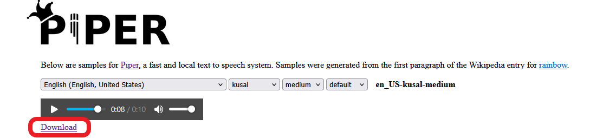

# Image-to-Video Pipeline POC with TTS

POC to turn still images and narration text into a final, narrated video using [Piper](https://github.com/rhasspy/piper/tree/master) and [CoQui](https://github.com/coqui-ai/TTS) TTS frameworks.

---

## Prereqs:

* Python 3.8+ and the following libraries:

### CoQui

If using Coqui AI:

```bash
pip3 install TTS pyyaml
```

Depending on the model you use, you may need to download certain packages. For the default, you'll need espeak and espeak-ng:

```bash
sudo apt install espeak espeak-ng
```
### Piper

If using Piper AI, you can install using pip:

```bash
pip3 install piper-tts
```

Then, download the .onnx and .onnx.json [files](https://github.com/rhasspy/piper/blob/master/VOICES.md) associated with the desired voice to the **voices** directory and run:

```bash
mkdir voices

echo 'Hello world!' | piper \
  --model voices/en_US-lessac-medium \
  --output_file hello_world.wav
```

There is also the option to utilize a GPU via the onnxruntime-gpu package, so if opting for that you'll need to download it:
```bash
.venv/bin/pip3 install onnxruntime-gpu
```

## Using the tool

First, add the images you'd like to use to the **assets/images** folder.

Then update **assets/script_mapping.yaml** to define each image and it's narration text. See the existing file for an example.

Then, run the script and specify which framework you want to use (CoQui or Piper):

```bash
python3 scripts/create_video.py --coqui

python3 scripts/create_video.py --piper
```

By default, this will:

* Generate audio for each text entry using specified TTS framework and default voices and parameters
* Create a short video for each image/audio pair
* Optionally prepend/append bumber videos stored in assets/bumpers
* Concatenate everything into a final video stored at outputs/final_output.mp4

### Optional flag

If you've previously generated audio/image clips that you don't want to overwrite, add the **-k** flag when you run the script and the .wav files stored in **assets/audio** will not be overwritten. They will be concatenated into the final video.

```bash
python scripts/create_video.py -k
```

### Piper model selection and voice parameters

When working with Piper, to use an alternate speaker, ensure the .onnx and .onnx.json files have been downloaded to the **voices** folder. Then you can run:

```bash
python scripts/create_video.py --piper --piper-voice en_US-kusal-medium
```

You can also supply several parameters to affect certain aspects of prosody and intonation.

* --ls (length_scale): controls duration of phonemes; **lower=faster speech**
* --ns (noice_scale): controls variation in prosody; **lower=flatter, more robotic**
* --nw (noise_w): controls variation in phoneme duration, pace, and rhythm

#### Examples:

```bas
python scripts/create_video.py --piper --ls .85 --ns .25 --nw .45
```

Some examples of parameter combinations:

| Style          | length_scale | noise_scale | noise_w |
|----------------|--------------|-------------|---------|
|Natural         | 1.0          | 0.33        | 0.5     |
|Expressive      | 1.1          | 0.5         | 0.6     |
|Calm, slow      | 1.25         | 0.3         | 0.4     |
|Fast, clear     | 0.85         | 0.25        | 0.45


## Choosing a TTS Model and Speaker

### CoQui

By default, the script uses **tts_models/en/vctk/vits**, which is a multi-speaker model. You can select a voice using the **speaker** parameter:

```python
tts.tts_to_file(text="Hello world", speaker="p225", file_path="out.wav")
```

To list al available speakers, at the Python command line run:
```python
print(tts.speakers)
```

### Piper

To test out different voices, there are samples located [here](https://rhasspy.github.io/piper-samples/)

You can then download the required .onnx and .onnx.json files by clicking the **Download** button beneath the audio player.



Other voice files to experiment with can be found [here](https://github.com/rhasspy/piper/blob/master/VOICES.md). 

By default, the script will look for these files in the **voices** folder, so be sure to place them there before running the script. 

To specify alternate preferred download locations in the script, edit the **voice_folder** parameter near the top of the script:

```python
...
# === Piper configuration ===
piper_bin = "piper"   #path to Piper binary
voice_folder = "voices"  #voice model file location
...
```

